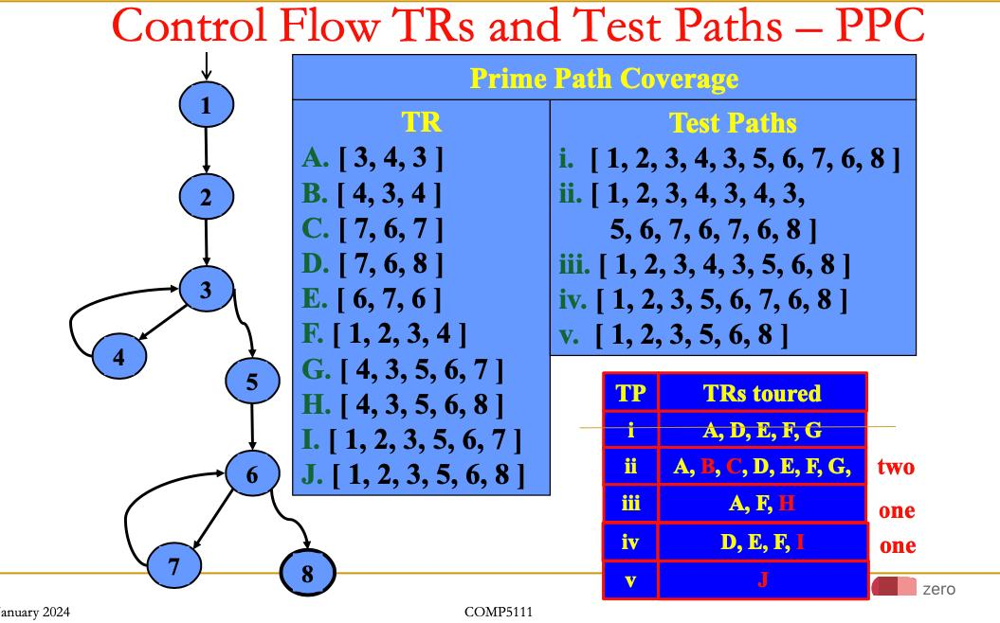

# HKUST-Course-COMP5111-Fundamentals-of-Software-Testing-and-Analysis
# 
需要自己设计一个TEST path来满足各种要求

Tool intrumentation 工具仪表
怎么理解？intrumentation 测量仪器, 仪表

no matter when we define it, we use the latest definition.
set an array to store the location of the definition and the usage DU pairs

# Instrumenting for Statement Coverage
1. Each node is given a unique id #
❑ Node # or statement #
2. Create an array indexed by id #s – nodeCover[]
3. Insert an instrument at each node
❑ nodeCover[i] ++;
4. Save nodeCover[] after each execution
❑ Must accumulate results across multiple test cases