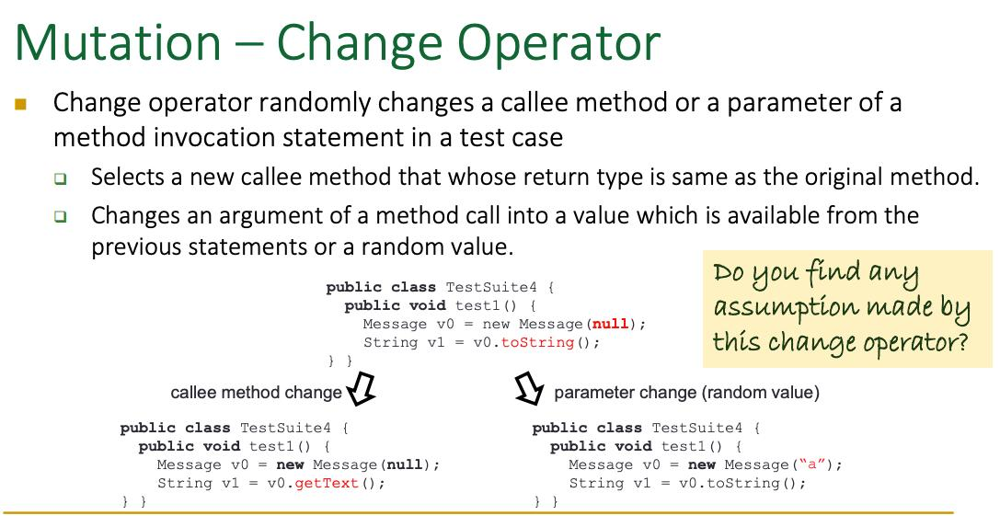

# HKUST-Course-COMP5111-Fundamentals-of-Software-Testing-and-Analysis
# 
需要自己设计一个TEST path来满足各种要求

Tool intrumentation 工具仪表
怎么理解？intrumentation 测量仪器, 仪表

no matter when we define it, we use the latest definition.
set an array to store the location of the definition and the usage DU pairs

# Instrumenting for Statement Coverage
分析定义的位置和使用的位置
1. Each node is given a unique id #
❑ Node # or statement #
2. Create an array indexed by id #s – nodeCover[]
3. Insert an instrument at each node
❑ nodeCover[i] ++;
4. Save nodeCover[] after each execution
❑ Must accumulate results across multiple test cases

# Symbolic testing 使用代数值来做测试,是静态代码测试吗？
但是目前bing没有人用这个方案，为什么？两个原因
the weakness of solving the 
can LLM help in some case solve the issue, might not be so optimistic
1 他的前提是可以想象把输入放入一个solver中，来确认是不是有解？但是并不是所有的代数解法
2 另外需要执行完所有的代码才能够得出结论？所以不现实。unrealistic, it requires on top of many libraies

# Concolic (CONCrete + symbOLIC) testing 就是用来解决这个问题呢
怎么会进入这个case，课堂示例是无法进入的情况，说明其实就是《无法进入的case》作为需要解决的方程式
简而言之，就是把不符合条件的作为 symbilc resolver来进行解决，符合条件的就不再作为解决的对象

Bisection method 二分法，在这里不是这个情况

# Automatic testing 从现在开始将dynamic testing
Evosuite: 可以解决一些 复杂的测试代码生成。
Dynamic symblici testing

# mutation analysis/testing
就是在参数上做变化，看下结果是不是一致的
immutate the developer's mistakes  
如果说参数变化了，但是结果没有变化，说明了什么？
我们需要让其结果变化，还是不变化呢？也就是说为了mutation test都找出来，然后拿这些Mutants test去测试原来的软件，看下原来的软件是不是有问题先使用了白盒测试，然后又执行了黑盒测试  
这里的fault指的是程序的异常输出。

substitutes 替代品
just to confirm the problem is what I'm thinking
也就是说，问题都有看下同类型的问题，他们有没有犯错。
coupled testing
所谓的operator，就是
Empirical observation=

这个问题可能会出现在考试里面：Do you find any assumption made by this change operator?  
对于一些弱引用类型，会出现问题。
计算一下，怎么

2024-3-17
先把问题变成一个统计学的问题，就有可能由机器来完成。 

